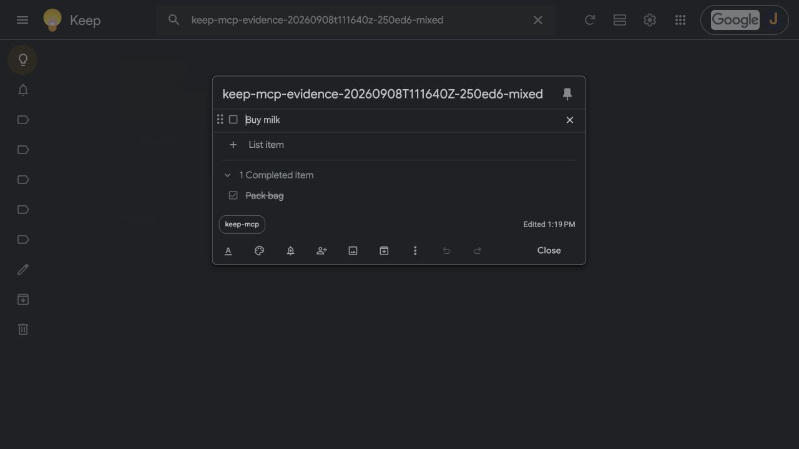

# CLI evidence: rejected checklist replacement

Run on 2026-09-08 with codex-cli 0.153.4, MCP SDK 2.0.0, stdio, safe mode.
Server code: `60c53ad7fdd2befa19018e66547bb94c78a882c8`. Only evidence documentation
was edited during this run. Codex launched the checkout's `.venv/bin/python -m server`.

The fixture was created earlier through Cursor 3.18.25. Codex verified its ID,
title and items before the rejected update. All four calls below ran in one
Codex CLI invocation, keeping the server's cached state alive.

## Prompt

```text
You are an MCP client exercising an authorized Keep fixture, not a coding assistant for this run. Use ONLY keep_evidence MCP tools. Do not read files, run shell commands, use browser tools, spawn agents, or access any other notes/labels. Never inspect credentials. Only allowed existing note ID: 1a080be57c6.5e92ea7e01242d66, expected title keep-mcp-evidence-20260908T111640Z-250ed6-mixed.
Perform sequentially in this same session: (1) get_note for that ID, stop if title differs. (2) update_note for that ID with title keep-mcp-evidence-20260908T111640Z-250ed6-mixed-unexpected and text Replacement. This intentionally tests rejection; do not repair/retry or use other tools as fallback. (3) If and only if the update is rejected, pin_note that same ID with pinned=true to sync cached changes, then get_note that ID. Stop. Report actual arguments, errors and returned title/items. Do not trash yet. Never touch other notes or labels. If any specified tool is unavailable or a call times out, stop and report it.
```

## Actual MCP calls and results

These are the completed MCP events from `codex exec --json`, with duplicate
structured output omitted. The failed update is the expected outcome.

```json
[
  {
    "server": "keep_evidence",
    "tool": "get_note",
    "arguments": {
      "note_id": "1a080be57c6.5e92ea7e01242d66"
    },
    "status": "completed",
    "content": [
      {
        "type": "text",
        "text": "{\"id\": \"1a080be57c6.5e92ea7e01242d66\", \"title\": \"keep-mcp-evidence-20260908T111640Z-250ed6-mixed\", \"text\": \"\\u2610 Buy milk\\n\\u2611 Pack bag\", \"type\": \"LIST\", \"pinned\": false, \"archived\": false, \"trashed\": false, \"color\": \"DEFAULT\", \"created\": \"2026-09-08T11:19:13.691000+00:00\", \"updated\": \"2026-09-08T11:20:22.362000+00:00\", \"labels\": [{\"id\": \"tag.j7uhp024ry80.1962a3e536c\", \"name\": \"keep-mcp\"}], \"collaborators\": [], \"items\": [{\"id\": \"1a080be57c6.33825353791151a6\", \"text\": \"Buy milk\", \"checked\": false, \"parent_item_id\": null}, {\"id\": \"1a080be57c6.3ed47a354dc09f8e\", \"text\": \"Pack bag\", \"checked\": true, \"parent_item_id\": null}], \"media\": []}"
      }
    ],
    "error": null
  },
  {
    "server": "keep_evidence",
    "tool": "update_note",
    "arguments": {
      "note_id": "1a080be57c6.5e92ea7e01242d66",
      "title": "keep-mcp-evidence-20260908T111640Z-250ed6-mixed-unexpected",
      "text": "Replacement"
    },
    "status": "failed",
    "content": [
      {
        "type": "text",
        "text": "Error executing tool update_note: Cannot replace checklist text: use the checklist item tools"
      }
    ],
    "error": null
  },
  {
    "server": "keep_evidence",
    "tool": "pin_note",
    "arguments": {
      "note_id": "1a080be57c6.5e92ea7e01242d66",
      "pinned": true
    },
    "status": "completed",
    "content": [
      {
        "type": "text",
        "text": "{\"id\": \"1a080be57c6.5e92ea7e01242d66\", \"title\": \"keep-mcp-evidence-20260908T111640Z-250ed6-mixed\", \"text\": \"\\u2610 Buy milk\\n\\u2611 Pack bag\", \"type\": \"LIST\", \"pinned\": true, \"archived\": false, \"trashed\": false, \"color\": \"DEFAULT\", \"created\": \"2026-09-08T11:19:13.691000+00:00\", \"updated\": \"2026-09-08T15:57:45.260000+00:00\", \"labels\": [{\"id\": \"tag.j7uhp024ry80.1962a3e536c\", \"name\": \"keep-mcp\"}], \"collaborators\": [], \"items\": [{\"id\": \"1a080be57c6.33825353791151a6\", \"text\": \"Buy milk\", \"checked\": false, \"parent_item_id\": null}, {\"id\": \"1a080be57c6.3ed47a354dc09f8e\", \"text\": \"Pack bag\", \"checked\": true, \"parent_item_id\": null}], \"media\": []}"
      }
    ],
    "error": null
  },
  {
    "server": "keep_evidence",
    "tool": "get_note",
    "arguments": {
      "note_id": "1a080be57c6.5e92ea7e01242d66"
    },
    "status": "completed",
    "content": [
      {
        "type": "text",
        "text": "{\"id\": \"1a080be57c6.5e92ea7e01242d66\", \"title\": \"keep-mcp-evidence-20260908T111640Z-250ed6-mixed\", \"text\": \"\\u2610 Buy milk\\n\\u2611 Pack bag\", \"type\": \"LIST\", \"pinned\": true, \"archived\": false, \"trashed\": false, \"color\": \"DEFAULT\", \"created\": \"2026-09-08T11:19:13.691000+00:00\", \"updated\": \"2026-09-08T15:57:45.260000+00:00\", \"labels\": [{\"id\": \"tag.j7uhp024ry80.1962a3e536c\", \"name\": \"keep-mcp\"}], \"collaborators\": [], \"items\": [{\"id\": \"1a080be57c6.33825353791151a6\", \"text\": \"Buy milk\", \"checked\": false, \"parent_item_id\": null}, {\"id\": \"1a080be57c6.3ed47a354dc09f8e\", \"text\": \"Pack bag\", \"checked\": true, \"parent_item_id\": null}], \"media\": []}"
      }
    ],
    "error": null
  }
]
```

## Google Keep checkpoint

After the rejected update and successful pin/sync, Keep still shows the original
title, unchecked Buy milk, and checked Pack bag.



## Coverage

The title-only update scenario and a live reproduction on the old build remain
unexecuted. The initial CLI attempt stopped at a tool-approval error before
reaching Keep. The completed run used per-tool approval for the authorised fixture
operations without changing global client configuration.

## Cleanup

Codex called `trash_note` only for `1a080be57c6.5e92ea7e01242d66`, then
`get_note` returned `trashed: true`. This was the only fixture created. Trash was
not emptied, and no existing notes or labels were modified.
