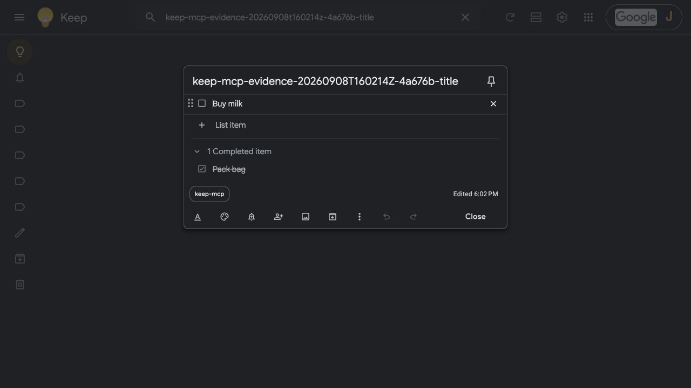
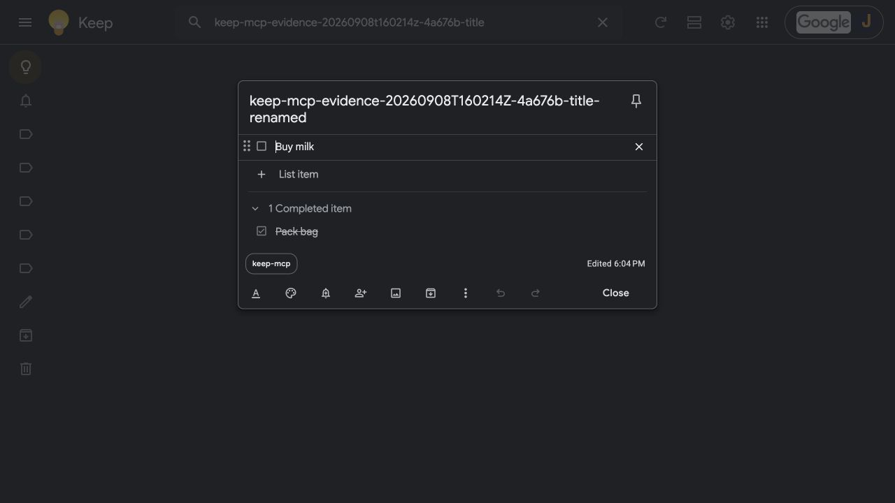

# CLI evidence: checklist creation and title-only update

Run on 2026-09-08 with codex-cli 0.153.4, Python 3.11.11, MCP SDK 2.0.0, stdio and safe mode.

Server commit: `3575c64f3b37292fb4790c3e7fbdfa672a01f673`. The CLI started the checkout's `.venv/bin/python -m server` for each invocation.

## Invalid checked state and valid creation

<details>
<summary>Saved prompt and actual MCP events</summary>

```text
Use ONLY keep_evidence MCP tools. No shell, files, browser, delegation or other integrations. Never access existing notes or change labels. First call create_list exactly once with title "keep-mcp-evidence-20260908T160214Z-4a676b-title-invalid" and items [{"text":"Buy milk","checked":"false"}]. Keep checked as the STRING "false", this must be rejected. Do not repair or retry. If rejected as expected, call create_list exactly once with title "keep-mcp-evidence-20260908T160214Z-4a676b-title" and items [{"text":"Buy milk","checked":false},{"text":"Pack bag","checked":true}]. Return actual tool results and new note ID, then STOP. Do not modify or trash anything. On timeout stop without retry.
```

Completed MCP events below retain actual arguments and selected result fields.

```json
[
  {
    "server": "keep_evidence",
    "tool": "create_list",
    "arguments": {
      "title": "keep-mcp-evidence-20260908T160214Z-4a676b-title-invalid",
      "items": [
        {
          "text": "Buy milk",
          "checked": "false"
        }
      ]
    },
    "status": "failed",
    "error": "Error executing tool create_list: Each item's checked field must be a boolean"
  },
  {
    "server": "keep_evidence",
    "tool": "create_list",
    "arguments": {
      "title": "keep-mcp-evidence-20260908T160214Z-4a676b-title",
      "items": [
        {
          "text": "Buy milk",
          "checked": false
        },
        {
          "text": "Pack bag",
          "checked": true
        }
      ]
    },
    "status": "completed",
    "result": {
      "id": "1a081c1ded2.9a1efd35132fe7d8",
      "title": "keep-mcp-evidence-20260908T160214Z-4a676b-title",
      "items": [
        {
          "id": "1a081c1ded2.49b25a9266dc34cc",
          "text": "Buy milk",
          "checked": false,
          "parent_item_id": null
        },
        {
          "id": "1a081c1ded2.021920b74a235009",
          "text": "Pack bag",
          "checked": true,
          "parent_item_id": null
        }
      ],
      "trashed": false
    }
  }
]
```

</details>

## Title-only update

<details>
<summary>Saved prompt and actual MCP events</summary>

```text
Use ONLY keep_evidence MCP tools on fixture ID 1a081c1ded2.9a1efd35132fe7d8. No other notes or labels, shell, files, browser, or delegation. First get_note that ID and verify title exactly "keep-mcp-evidence-20260908T160214Z-4a676b-title". If different, stop. Then call update_note exactly once with ONLY note_id and title="keep-mcp-evidence-20260908T160214Z-4a676b-title-renamed". Omit text entirely. Then get_note that ID to verify the title changed and the item IDs, texts, and checked states are unchanged. Return actual results and stop. Do not trash yet. On error or timeout stop without retry.
```

Completed MCP events below retain actual arguments and selected result fields.

```json
[
  {
    "server": "keep_evidence",
    "tool": "get_note",
    "arguments": {
      "note_id": "1a081c1ded2.9a1efd35132fe7d8"
    },
    "status": "completed",
    "result": {
      "id": "1a081c1ded2.9a1efd35132fe7d8",
      "title": "keep-mcp-evidence-20260908T160214Z-4a676b-title",
      "items": [
        {
          "id": "1a081c1ded2.49b25a9266dc34cc",
          "text": "Buy milk",
          "checked": false,
          "parent_item_id": null
        },
        {
          "id": "1a081c1ded2.021920b74a235009",
          "text": "Pack bag",
          "checked": true,
          "parent_item_id": null
        }
      ],
      "trashed": false
    }
  },
  {
    "server": "keep_evidence",
    "tool": "update_note",
    "arguments": {
      "note_id": "1a081c1ded2.9a1efd35132fe7d8",
      "title": "keep-mcp-evidence-20260908T160214Z-4a676b-title-renamed"
    },
    "status": "completed",
    "result": {
      "id": "1a081c1ded2.9a1efd35132fe7d8",
      "title": "keep-mcp-evidence-20260908T160214Z-4a676b-title-renamed",
      "items": [
        {
          "id": "1a081c1ded2.49b25a9266dc34cc",
          "text": "Buy milk",
          "checked": false,
          "parent_item_id": null
        },
        {
          "id": "1a081c1ded2.021920b74a235009",
          "text": "Pack bag",
          "checked": true,
          "parent_item_id": null
        }
      ],
      "trashed": false
    }
  },
  {
    "server": "keep_evidence",
    "tool": "get_note",
    "arguments": {
      "note_id": "1a081c1ded2.9a1efd35132fe7d8"
    },
    "status": "completed",
    "result": {
      "id": "1a081c1ded2.9a1efd35132fe7d8",
      "title": "keep-mcp-evidence-20260908T160214Z-4a676b-title-renamed",
      "items": [
        {
          "id": "1a081c1ded2.49b25a9266dc34cc",
          "text": "Buy milk",
          "checked": false,
          "parent_item_id": null
        },
        {
          "id": "1a081c1ded2.021920b74a235009",
          "text": "Pack bag",
          "checked": true,
          "parent_item_id": null
        }
      ],
      "trashed": false
    }
  }
]
```

</details>

The invalid string boolean was rejected. Valid booleans were preserved.
The title-only update supplied only `note_id` and `title`. Both returned item IDs,
texts and checked states matched the original creation result.

## Google Keep before and after

Before the title-only update:



After the title-only update and browser reload:



The scoped Keep search for the invalid title returned no matching results. Its raw
capture remains local because Keep also displayed unrelated label names.

## Cleanup

`trash_note` moved fixture `1a081c1ded2.9a1efd35132fe7d8` to recoverable Trash.
The subsequent `get_note` returned `trashed: true`. No existing notes or labels
were modified.
